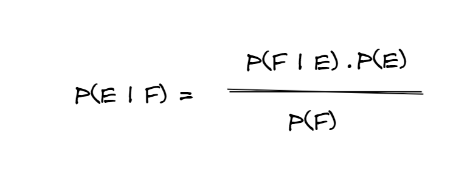
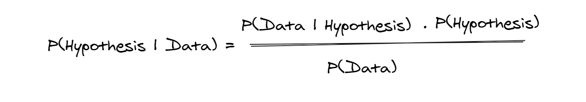
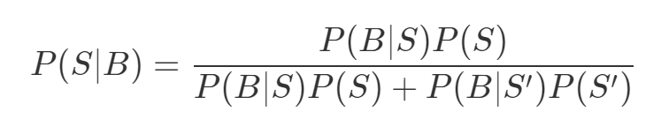
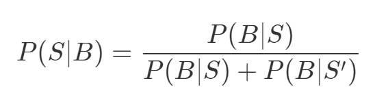
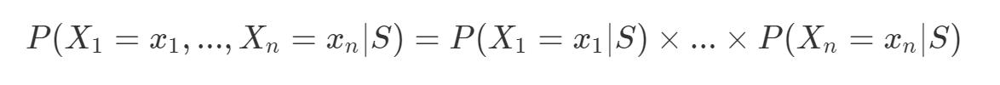
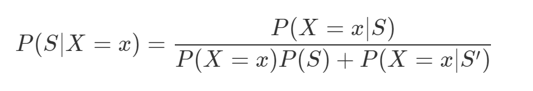

So I finally figured out how to render LaTeX equations on my blog, and thus I can use my truly "useful" LaTex knowledge to start a new series on something that truly interests me. Machine Learning and how it works using the relative math in a simpler (and hopefully fun) language, to not scare away people who don't prefer maths. Welcome to my series **Machine Learning, with the Maths**! (It sounds way cooler in my head!)

The point of this series is not to be a substitute for the plethora of tutorials already available on the topic of Machine Learning. I will try to explain the basic concepts behind each machine learning algorithm, and try to implement it from scratch using Python and NumPy. Maybe you can and hopefully will find better resources, but I hope this can be a good start for you. Plus, where else can I use my superbly huge and comically large Latex equations. Let's begin, this probably very long post.

I am planning to write an introductory post on Bayes theorem anyways, so I am gonna skip the gory details here and link it in this post when I do end up writing it. Here's the short intro to Bayes theorem.

There are a lot of ways to define what Bayes theorem represents. It can be thought of way to "reverse" conditional probabilities. The interpretation we will be going through is that it can be used to find the probability of an event occurring, given the probability of another event that has already occurred. We can use (fun?) letters to denote some events, but hey, this is a Machine Learning post, so lets talk like that. Say you have a hypothesis (or an assumption) and you want to find the probability of that assumption, given the data. That is actually what Bayes theorem gives! Don't believe me?. Let's look at the equations



This says that the gives the probability of event E occuring, given some event F occurs. Say event **E** represents our hypothesis and **F** represents the probability of obsering the data we observe. Then P(E|F) basically represents how much the data supports our assumption. Hence many times, Bayes theorem is also written like this



The term P(Hypothesis) is also called **prior** or *prior beliefs*. Why prior? It is the degree of the conviction that the hypothesis is true *before we observe* the actual data. Remember, prior is the sometimes the trickiest terms to determine ([as mentioned later here](#the-horrors-of-prior)). The term P(Hypothesis|Data) is called the **posterior** probability, which represents "the possibility of the hypothesis, given the data". Posterior is usually build after seeing the data. The term P(Data|Hypothesis) is a fun one. It represents the probability of having obtained the data, given the hypothesis and is called the **likelihood** term. In that way, P(Data) is the **Evidence** we have, or the data we have.

The evidence term can be broken as P(F) = P(F|E)P(E) + P(F|E')P(E') as well, which might come in handy later.

## How Bayes Theorem is relevant to Machine Learning?

What Bayes theorem gives us is a framework to update our beliefs using evidence. Say you have a prior belief that some event occurs. Then you receive some evidence. You weigh your prior using the likelihood of that evidence happening and get a new belief, the posterior! Now when you get some more new evidence, you replace your prior belief with the posterior found about the event, and get a new posterior belief. And hey if you are not a probability nerd, let me explain this to you in a simpler way. Say you are a man who have lived his whole life inside a cave, and never got out. Now once you get out and see the sun rising on the east, what do you believe? Does it always happen or is this a one off? You assign some "prior" probability of the sun rising in the east. The next day, the sun rises in east again and you update your belief using this evidence. Hmm, sun might rise on east on Mondays and Tuesdays and again update your belief (posterior). The more evidence you gather, the more you are sure about an event, and frankly that's the crux of Machine Learning as well. We use data, or evidence, to update our beliefs about something.

Now with that out of the way, let's turn to the example and actually implement this.

## Spam me not!

The most common use of Naive Bayes, is for spam filters. Let's look into how we can implement a spam filter using Naive Bayes from scratch. 

Sometime ago, there was a scam on twitter where accounts of [famous people like Elon Musk, Jeff Bezos etc. were hacked for "bitcoin" scams](https://economictimes.indiatimes.com/magazines/panache/twitter-accounts-of-bill-gates-jeff-bezos-elon-musk-hacked-in-bitcoin-scam/articleshow/76991797.cms), and let's try to build a spam filter to help the poor souls who actually sent bitcoins to this scam. Let **S** be the event that *the message is spam* and **B** be the event that *the message contains the word 'bitcoin'*. Baye's theorem tells us that the conditional probability that the message is spam, given it contains the word bitcoin is:



The numerator is the probability that a message is spam *and* contains *bitcoin*, while the denominator is just the probability that a message contains *bitcoin*. How? P(B|S)P(S) = P(B,S) using the definition of conditional probablity (on which I did write a [fun post you can read here](http://mitesh1612.github.io/blog/Conditional-Probability-and-Families)) and the denominator is essentially P(B). In this sense, we can think of this calculation simply representing the **proportion** of *bitcoin* messages are spam.

Say we have a large number of messages that we know are **spam** and a large collection of messages that we know are **ham** (the word used for not spam commonly). Using that we can easily estimate P(B|S) and P(B|S'). Let's make an assumption that it is equally likely that a message is spam or ham. Then P(S) = P(S') = 0.5. Taking out the common term in the above equation, we get



Now say we find out that 50% of the spam messages contain the word bitcoin but only 1% of non spam messages do, then the probablity that any given *bitcoin*-containing message is spam is:

0.5/(0.5 + 0.01) = 98%

### Making the Spam Filter more Sophisticated

Let's bring in equations now (this aint called Machine Learning with Maths for no reason). Imagine we have a vocabulary of many words w1, w2, ... ,wn and we say event Xi means the message contains the word wi. Also, since we are imagining so much, imagine that we have some undisclosed process to get an estimate of P(Xi|S) and P(Xi|S'), or basically the probability that a spam/not spam message contains the ith word.

### Why is this Bayes Naive?

The key to Naive Bayes is making the (big) assumption that the presences (or absences) of each word are independent of one another, conditional on a message being spam or not. Intuitively, this assumption means that knowing whether a certain spam message contains the word *bitcoin* gives you no information about whether that same message contains the word *rolex*. In terms of ML terminologies, it makes the assumption that features of a measurement are independent of each other.

In math terms, this assumption means that:



Now I am not going to lie, this is an extreme assumption, and the reason why it is called Naive Bayes. Say our vocabulary contains only the words "bitcoin" and "gold" and that half the messages that are spam are for "earn bitcoin" and the other half messages that are spam are for "26kt gold". Thus P(Bitcoin|Spam) = 0.5 and P(Gold|Scam) = 0.5 as well. The probability that a message is spam which contains both "bitcoin" and "gold" is P(Bitcoin, Gold|Spam) = P(Bitcoin|Spam) * P(Gold|Spam) = 0.5 x 0.5 = 0.25. This happens since we assumed away the knowledge that "bitcoin" and "gold" never occur together.

The fun part is that, despite the unrealisticness of this assumption, this model often performs well and has historically been used in actual spam filters.

Using the same equation that we used for the bitcoin only spam filter, we can calculate the probability of a message being spam using the following equation:



The Naive Bayes assumption allows us to compute each of the probabilities on the right simply by multiplying together the individual probability estimates for each vocabulary word and hence simplifies our calculation.

### A practical consideration

In order to prevent [underflow](https://en.wikipedia.org/wiki/Arithmetic_underflow), where in computers don't do well with floating-point numbers that are too close to 0, we try to avoid multiplying probability values. Instead of that, we can use `log` to multiply probabilities using `log(ab) = log(a) + log(b)` and then do an `exp(logx) = x` to get back the actual probability. This doesn't change any of the equations or assumptions, it is just a small practical trick to avoid getting weird answers.

### Training?

Now the only problem is estimating P(Xi|S) and P(Xi|S'), the probabilities that a spam message (or nonspam message) contains the word wi. If we have a fair number of "training" messages labeled as spam and not spam, an obvious first try is to estimate P(Xi|S) simply as the fraction of spam messages containing the word wi.

#### Being Smooth

While this calculation seems reasonable, it has a huge problem. Say, in our training messages, the word "data" only occurs in nonspam messages. Then we’d estimate P(data|S)=0. The result is that our Naive Bayes classifier would always assign spam probability 0 to any message containing the word *data*, even a message like “data on free bitcoin and 26 kt gold free.” To avoid this, we usually use some kind of **smoothing**. One of the simplest ways is to choose a pseudo count `k` (basically assuming that there are atleast `k` spam/ham messages containing the given word i). This gives us the following equation for estimating the probability of seeing the ith word in a spam or ham message as follows:

%20%3D%20%5Cfrac%7B(k%20%2B%20%5C%23%20of%20spams%20containing%20w_i)%7D%7B(2k%20%2B%20%5C%23%20of%20spams)%7D%0D)

We can do similarly for P(Xi|S') where in we assume we also saw k additional nonspams containing the word and k additional nonspams not containing the word.

For example, if data occurs in 0/98 spam messages, and if k is 1, we estimate P(data|S) as 1/100 = 0.01, which allows our classifier to still assign some nonzero spam probability to messages that contain the word *data*.

### Code Implementation

Now that we have all the pieces to build our classifier, the only thing to do is to actually build our classifier. This post contains code snippets but you can find the code on my GitHub repo [here](https://github.com/mitesh1612/Machine-Learning-From-Scratch/blob/master/NaiveBayes/NaiveBayes.ipynb)

Since we are planning to deal with text data with this classifier, we will be needing to **tokenize** our text to words/tokens. We assume we have a simple function `tokenize()` that returns all the tokens in a sentence. (A simple implementation for this would be to convert all text to lower case and then use regular expressions to remove special characters like apostrophes). We can obviously have complex tokenizing pipelines and more text pre-processings, but we will skip that for now.

Our training data consists of the message and a boolean `is_spam` indicating whether the message is spam?. We implement our classifier as a class to use it in a better way. The constructor only takes the parameter `k`. We also initialize a `set` to contain unique tokens, dictionaries  which are counters to track how often each token is seen in spam messages and ham messages, and the counts of how many spam and ham messages it was trained on.

```python
class NaiveBayesClassifier:
    def __init__(self, k = 0.5):
        self.k = k

        self.tokens = set()
        self.token_spam_counts = defaultdict(int)
        self.token_ham_counts = defaultdict(int)
        self.spam_messages = self.ham_messages = 0
```

Now to implement the `train` function for it. According to the message type, we first increment the counts of spam or ham messages. Then we tokenize the message and then increment the spam/ham counts for each token.

```python
def train(self, messages):
    for message in messages:
        if message.is_spam:
            self.spam_messages += 1
        else:
            self.ham_messages += 1

        # Increment word counts
        for token in tokenize(message.text):
            self.tokens.add(token)
            if message.is_spam:
                self.token_spam_counts[token] += 1
            else:
                self.token_ham_counts[token] += 1
```

Ultimately we’ll want to predict P(spam | token). As we saw earlier, to apply Bayes’s theorem we need to know P(token | spam) and P(token | ham) for each token in the vocabulary. So we’ll create a helper function to compute those. (`_probabilities`)

```python
def _probabilities(self, token):
    """
    Returns P(token|spam) and P(token|ham)
    """
    spam = self.token_spam_counts[token]
    ham = self.token_ham_counts[token]

    p_token_spam = (spam + self.k) / (self.spam_messages + 2 * self.k)
    p_token_ham = (ham + self.k) / (self.ham_messages + 2 * self.k)

    return p_token_spam, p_token_ham
```

Finally we can write a `predict` method, and we will use the method of summing logs ([as mentioned in here](#a-practical-consideration)). This takes a message and tokenizes it. Then using the helper function it finds the probabilities of each token in the vocabulary. Then adds/multiplies the respective probability of seeing/not seeing the token in te message and then returns the probability of the given message being spam or ham.

```python
def predict(self, text):
    text_tokens = tokenize(text)
    log_prob_if_spam = log_prob_if_ham = 0.0

    # Iterate through each word in vocabulary
    for token in self.tokens:
        prob_if_spam, prob_if_ham = self._probabilities(token)

        # If token appears in message
        # add the log probability of seeing it
        if token in text_tokens:
            log_prob_if_spam += math.log(prob_if_spam)
            log_prob_if_ham += math.log(prob_if_ham)
        # Otherwise add the log probability
        # of not seeing it which is
        # log(1-probability of seeing it)
        else:
            log_prob_if_spam += math.log(1-prob_if_spam)
            log_prob_if_ham += math.log(1-prob_if_ham)
    prob_if_spam = math.exp(log_prob_if_spam)
    prob_if_ham = math.exp(log_prob_if_ham)
```

### Inspecting the Model

We can even have a helper function that "inspect" the model's innards see which words are indicative of spam/not spam.

```python
def p_spam_given_token(token, model):
    prob_if_spam, prob_if_ham = model._probabilities(token)

    return prob_if_spam/(prob_if_spam + prob_if_ham)
words = sorted(model.tokens, key=lambda t: p_spam_given_token(t,model))
print("Spammiest Words: ", words[-10:])
print("Hammiest Words: ", words[:10])
```

#### Trying out the model on a dataset

We will run this model on the UCI ML SMS Spam Dataset [which can be found here](https://archive.ics.uci.edu/ml/datasets/SMS+Spam+Collection). For the detailed code, you can visit this [notebook in my GitHub repo](https://github.com/mitesh1612/Machine-Learning-From-Scratch/blob/master/NaiveBayes/NaiveBayes.ipynb)

The model returns "claim" "prize" as words indicating the message is spam which is a good sign of this performing okay.

#### Possible Improvements

How could we get better performance? One obvious way would be to get more data to train on. There are a number of ways to improve the model as well. Here are some possibilities that you might try:

* Our classifier takes into account every word that appears in the training set, even words that appear only once. Modify the classifier to accept an optional min_count threshold and ignore tokens that don’t appear at least that many times.
* The tokenizer has no notion of similar words (e.g., cheap and cheapest). Modify the classifier to take an optional stemmer function that converts words to equivalence classes of words.
* Although our features are all of the form “message contains word wi,” there’s no reason why this has to be the case. In our implementation, we could add extra features like “message contains a number” by creating phony tokens like contains:number and modifying the tokenizer to emit them when appropriate.

## The horrors of prior 

After all that code, there is one small topic I would like to touch on, which is on estimating priors.

Prior is one of the trickiest terms to determine in the Bayes equation. As explained really nicely in [this video by Veritasium](https://youtu.be/R13BD8qKeTg), Bayes theorem tells us how to update our beliefs in light of new evidence. It cant tell us how to set our prior beliefs. So it is possible for someone to have a different prior belief than other, because they are subjective. Some people might be more certain about a prior belief that other people. That's how bias can creep in. And we definitely need a world, and a model, with lesser bias.

Mathematically, instead of "choosing" a prior, we assume the prior probability to follow a prior model and we try to estimate these model parameters (for example assuming the prior distribution follows Gaussian distribution and finding its parameters)

## For further exploration

You can visit [this blog](https://aihubprojects.com/naive-bayes-algorithm-from-scratch/) for another "from scratch" implementation of Naive Bayes or [this blog](https://chrisalbon.com/machine_learning/naive_bayes/naive_bayes_classifier_from_scratch/) as well .

The idea and much of the code was from the book ["Data Science from Scratch"](https://www.amazon.in/Data-Science-Scratch-Joel-Grus/dp/149190142X) which is truly an amazing read for someone who wants to implement stuff from scratch.

If you stuck with me till this long, it seems you enjoyed this post. I hope to keep updating this new **Machine Learning, with the Maths** series so keep an eye on this blog. You can always @ me at my socials or the GitHub repo for this blog. Thanks for reading. 😊